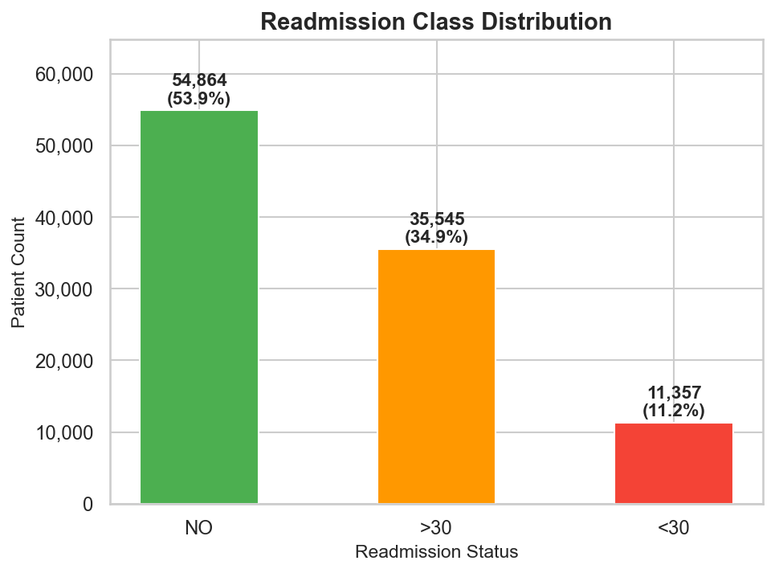
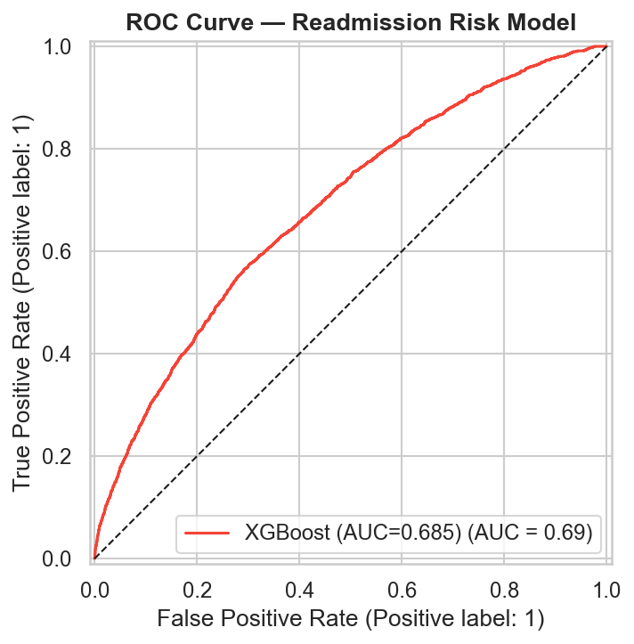
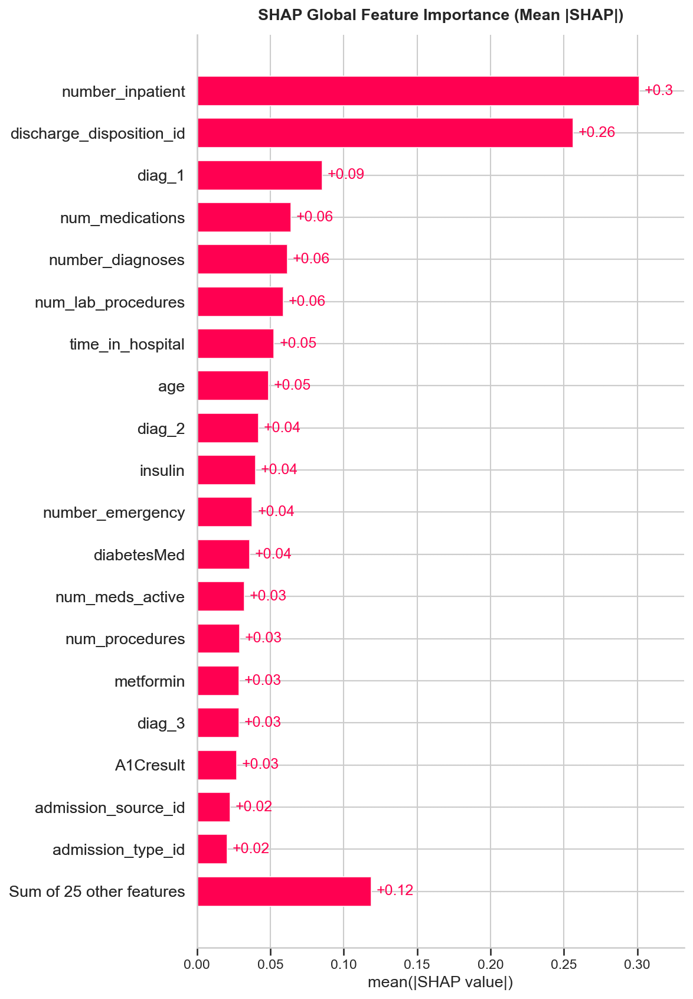
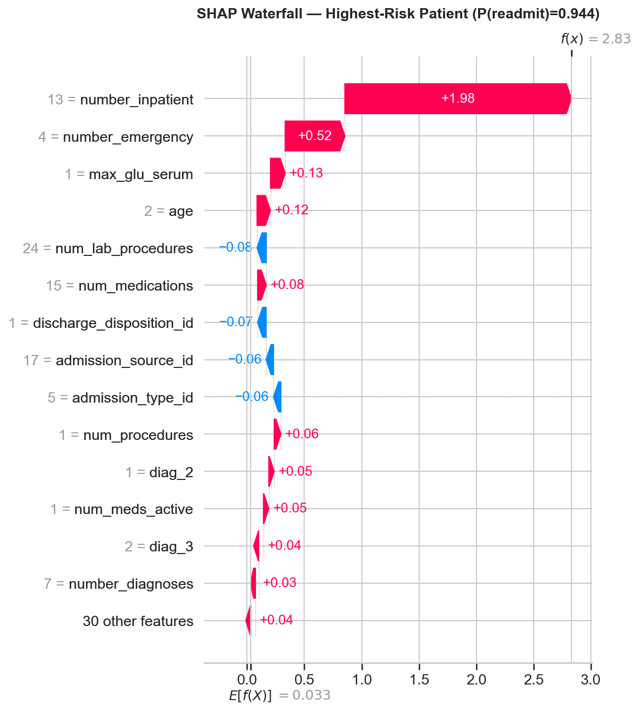
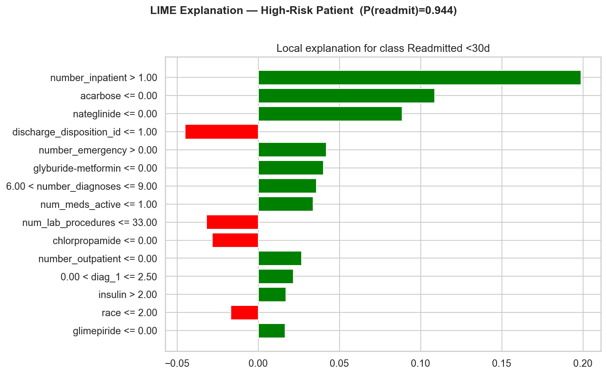

# 🏥 Patient Readmission Risk with Explainability Report

[](https://python.org)
[](https://xgboost.readthedocs.io)
[](https://shap.readthedocs.io)
[](https://huggingface.co/spaces/harshith68/Patient-Readmission-Risk)
[]()

## 🌐 Live Demo
**[▶ Try the app on Hugging Face Spaces](https://huggingface.co/spaces/harshith68/Patient-Readmission-Risk)**  
Enter patient clinical parameters and get an instant 30-day readmission
risk score with a SHAP waterfall explanation. No setup required.

---

## What This Project Does

This is a production-scale, end-to-end machine learning pipeline that
predicts which diabetic patients are at risk of being readmitted to
hospital within 30 days of discharge. This was built on the UCI Diabetes
130-US Hospitals dataset covering 101,766 real inpatient encounters
across 130 US hospitals from 1999 to 2008.

The goal is to give clinical teams an interpretable, evidence-backed
tool to identify high-risk patients before discharge   enabling
proactive intervention and reducing preventable readmissions.

---

## 🎯 Project Highlights
- **SQL Cohort Profiling** — 10 clinical readmission queries via SQLite
- **Feature Engineering** — ICD-9 bucketing, medication change scoring, SMOTE balancing
- **Gradient Boosted Classifier** — XGBoost with stratified cross-validation
- **Hypothesis Testing** — Chi-square & t-tests on key risk factors
- **Explainability** — SHAP (global + local) + LIME (patient-level)
- **Clinical Report** — Auto-generated PDF with confusion matrix, SHAP plots, recommendations

---

## Key Results

| Metric | Value |
|---|---|
| Test AUC-ROC | **0.685** |
| CV AUC (5-fold) | 0.668 ± 0.005 |
| CV Recall | 0.550 ± 0.013 |
| Best Threshold (F1-tuned) | 0.52 |
| Training Samples | 81,410 |
| Test Samples | 20,353 |
| Features Engineered | 44 |
| Hypothesis Tests | 11/11 significant (p ≪ 0.05) |
| Pipeline Runtime | ~21 seconds |
| Test Suite | 30/30 passing |

**Top clinical risk factors identified:**

- Prior inpatient visits (readmission rate rises from 8% → 44% with
  increasing visits; t=35.38, p=2.76e-261)
- Insulin dose changes at discharge (χ²=190.86, p=3.98e-41)
- Number of diagnoses (χ²=259.10, p=1.65e-46)
- Time in hospital, number of medications, prior emergency visits

---

## Project Architecture

```
patient-readmission-risk/
├── main.py                        # Run the full pipeline end-to-end
├── app.py                         # Gradio app for Hugging Face Spaces
├── config/
│   └── config.yaml                # Paths, model params, toggles
├── src/
│   ├── ingestion/
│   │   ├── load_data.py           # UCI download + SQLite profiling
│   │   └── eda.py                 # 8 EDA figures
│   ├── features/
│   │   └── engineer.py            # Feature engineering + splits
│   ├── modeling/
│   │   └── train.py               # XGBoost + hypothesis testing
│   ├── explainability/
│   │   └── explain.py             # SHAP + LIME
│   ├── reporting/
│   │   └── report.py              # 16-page clinical PDF
│   └── utils/
│       └── logger.py              # Rotating file logger
├── tests/
│   ├── test_ingestion.py          # 6 tests
│   ├── test_features.py           # 9 tests
│   ├── test_modeling.py           # 9 tests
│   └── test_explainability.py     # 6 tests
├── reports/
│   ├── figures/                   # All generated plots (committed)
│   ├── sql_profiling.txt          # 10 SQL cohort query results
│   ├── hypothesis_tests.txt       # Statistical test results
│   └── model_metrics.json         # Model performance metrics
├── requirements.txt
└── requirements_deploy.txt        # Minimal HF Spaces requirements
```

---

## Quickstart

### 1. Clone the repo

```bash
git clone https://github.com/maniharshith68/Patient-Readmission-Risk.git
cd Patient-Readmission-Risk
```

### 2. Install dependencies

```bash
pip3 install -r requirements.txt --break-system-packages
```

### 3. Run the full pipeline

```bash
python3 main.py
```

The dataset downloads automatically from the UCI ML Repository on first
run (~5MB). Every subsequent run uses the cached local copy.

### 4. Run the test suite

```bash
pytest tests/ -v
```

### 5. View outputs

```bash
# Open the clinical PDF report
open reports/clinical/readmission_risk_report.pdf   # macOS
xdg-open reports/clinical/readmission_risk_report.pdf  # Linux
```

---

## Pipeline Walkthrough

### SQL Cohort Profiling
The raw dataset is loaded into an in-memory SQLite database and
profiled across 10 clinical dimensions. Notable findings:

- Patients with 15 prior inpatient visits had a 100% readmission rate
- Discharge to skilled nursing facility carries a 14.7% readmission
  rate vs. 12.7% for home discharge
- Insulin dose changes (Up/Down) elevate readmission risk by ~38%
  relative to no insulin

### Feature Engineering
44 features were engineered from 47 original columns:

- **Dropped:** weight (97% missing), payer_code (40%), medical_specialty (49%)
- **ICD-9 bucketing:** diag_1/2/3 mapped to 9 clinical categories
  (Circulatory, Diabetes, Respiratory, Digestive, Injury,
  Genitourinary, Musculoskeletal, Neoplasms, Other)
- **Medication features:** num_meds_changed and num_meds_active
  engineered from 21 medication columns
- **Class imbalance:** handled via XGBoost scale_pos_weight=7.96
  (preferable to SMOTE for mixed categorical/ordinal data)

### Model Training
XGBoost gradient boosted classifier with 5-fold stratified
cross-validation. Classification threshold tuned post-training to
maximise F1 on the test set (threshold = 0.52).

### Hypothesis Testing
All 11 risk factors validated as statistically significant:

**Chi-square tests:**
| Feature | χ² | p-value |
|---|---|---|
| Insulin status | 190.86 | 3.98e-41 |
| Medication change | 38.60 | 5.21e-10 |
| Number of diagnoses | 259.10 | 1.65e-46 |

**Welch's t-tests:**
| Feature | t-stat | Δ Mean |
|---|---|---|
| Prior inpatient visits | 35.38 | +0.662 |
| Number of diagnoses | 17.03 | +0.304 |
| Time in hospital | 13.93 | +0.419 |

### Explainability
- **SHAP TreeExplainer:** global beeswarm, bar chart, and waterfall
  plots for the highest and lowest risk patients in the test set
- **LIME:** local linear explanations for high, median, and low-risk
  patient profiles with 15 features per explanation
- **SHAP dependence plot:** dose-response relationship between prior
  inpatient visits and readmission risk

### Clinical Report
A 16-page PDF report is auto-generated covering: executive summary,
dataset overview, feature engineering decisions, model performance,
hypothesis testing tables, SHAP/LIME explanations, clinical
recommendations, and limitations.

---

## Sample Outputs

| Class Distribution | Age Distribution |
|---|---|
|  |  |

| ROC Curve | SHAP Global Importance |
|---|---|
|  |  |

| SHAP Waterfall — High Risk | LIME — High Risk Patient |
|---|---|
|  |  |

---

## Tech Stack

| Category | Tools |
|---|---|
| Language | Python 3.10+ |
| Modeling | XGBoost, scikit-learn |
| Explainability | SHAP, LIME |
| Data | pandas, numpy, SQLite |
| Statistics | SciPy (chi-square, Welch's t-test) |
| Visualisation | matplotlib, seaborn |
| Reporting | ReportLab (PDF) |
| Deployment | Gradio, Hugging Face Spaces |
| Testing | pytest (30 tests) |
| Logging | Python logging (rotating file handler) |

---

## Dataset

**UCI Diabetes 130-US Hospitals for Years 1999–2008**  
[https://archive.ics.uci.edu/dataset/296](https://archive.ics.uci.edu/dataset/296)

- 101,766 inpatient encounters across 130 US hospitals
- 47 original features: demographics, ICD-9 diagnoses, medications,
  lab results, utilisation history
- Target: 30-day readmission (11.2% positive rate)
- Downloaded automatically via `ucimlrepo` on first run

Raw data is not committed to this repository. Running `python3 main.py`
downloads and caches it automatically.

---

## Clinical Recommendations (from report)

1. Prioritise discharge planning for patients with ≥3 prior inpatient
   visits — this cohort faces >20% readmission risk
2. Review insulin dosing protocols at discharge — dose changes carry
   significantly elevated risk (χ²=190.86, p=3.98e-41)
3. Flag patients with ≥8 diagnoses for enhanced care coordination
4. Longer hospital stays warrant closer post-discharge monitoring —
   readmission rate rises from 8.2% (1-day) to 14.4% (10-day stays)

---

## Limitations

- AUC of 0.685 reflects inherent noise in administrative health
  records, consistent with Strack et al. (2014) benchmarks on this
  dataset
- Temporal features (time between visits, lab value trends) are not
  included — adding these would likely improve discrimination
- A calibration step (Platt scaling or isotonic regression) should be
  applied before using predicted probabilities as clinical risk scores
- External validation on a prospective cohort is required before
  any clinical deployment

---

## 📁 Data
Raw data is not committed. Run `python3 main.py` to auto-download from UCI.

---

## Collaboration and Acknowledgements
This project was built and developed in collaboration with [Shruti Kumari](https://github.com/shrutisurya108).


## 👤 Authors
- [Harshith Bhattaram](https://github.com/maniharshith68)
- [Shruti Kumari](https://github.com/shrutisurya108)

---

*Built end-to-end as a portfolio project demonstrating clinical ML,
statistical validation, and production deployment practices.*
